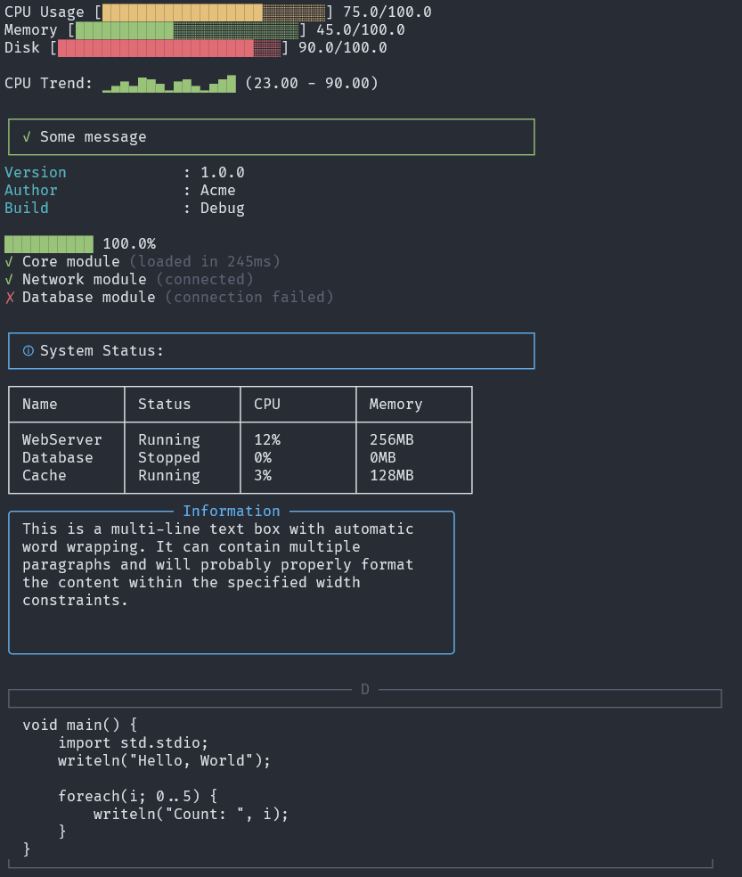

## Ark

TUI and terminal component library.

Line charts, bar charts, pie charts, more or less everything for data visualization, TUIs and CLIs.

#### Components accessible via `ArkTerm` static class

```
function drawLineGraph
function drawTable
function drawAlert
function drawKeyValue
function drawSpinner
function clearSpinner
function drawStatus
function drawProgress
function drawColumns
function drawTree
function drawGauge
function drawTextBox
function drawBanner
function drawDashboard
function drawSparkline
function drawCodeBlock
function drawToast
function drawLoadingDots
function drawBreadcrumb
function drawSeparator
function drawFlowDiagram
function drawBarChart
function drawPieChart
function drawBreakdownChart
function printColorized
```

Refer to ui.d's unit tests for detailed example usage.

#### Screenshot



No warranty. Not ever.
